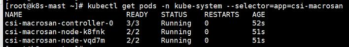
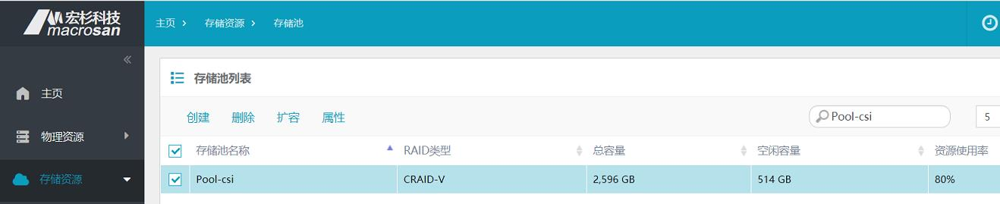
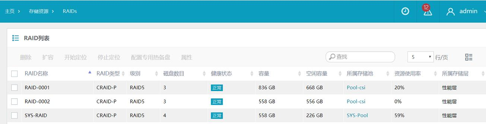
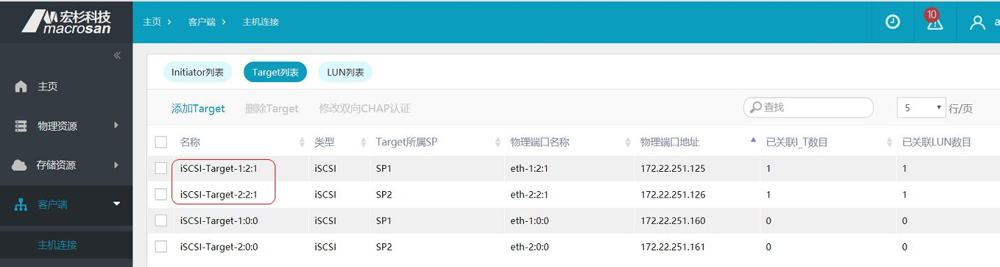
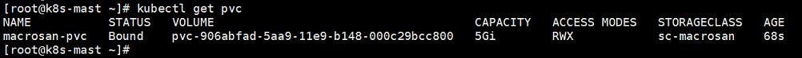
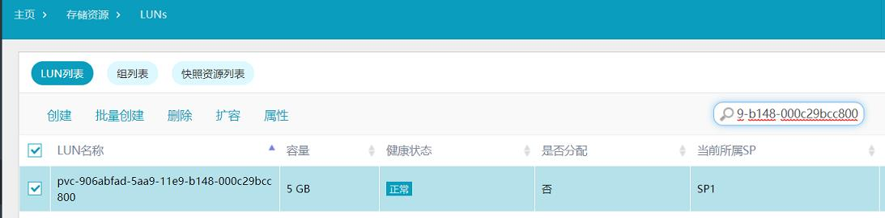
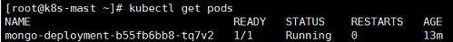

＃MacroSAN CSI 1.0.0111111111111111工工工工工工工a

[Container Storage Interface (CSI)](https://github.com/container-storage-interface/) driver, provisioner, and attacher for MacroSAN.

## Overview
MacroSAN CSI plugins implement an interface between CSI enabled Container Orchestrator (CO) and the storage of MacroSAN. It allows dynamically provisioning MacroSAN volumes and attaching them to workloads. Current implementation of MacroSAN CSI plugins was tested in Kubernetes environment (requires Kubernetes 1.13+), but the code does not rely on any Kubernetes specific calls (WIP to make it k8s agnostic) and should be able to run with any CSI enabled CO.

For details about configuration and deployment of MacroSAN CSI plugins, please refer the documentation.

For example usage of this MacroSAN CSI plugins, see examples below.


Before to go, you should have [MacroSAN block-storage Product](http://www.macrosan.com/).

You can get latest version of MacroSAN CSI driver at [docker hub](https://hub.docker.com/u/macrosan/) by running docker `docker  pull macrosan/csi-macrosan:v1.0.0 `

# Deployment

In this section，you will learn how to deploy the CSI driver and some necessary sidecar containers.

## Prepare cluster ##

| Cluster | version |
| ----------| --------------|
| Kubernetes | 1.13 + |
| MacroSAN ODSP | 1.3.5 +   |


## Deploy CSI plugins

### Plugins
#### Get yaml file and bash shell

Get yaml file from below links:

- [csi-controller-rbac.yaml](./kubernetes/csi-controller-rbac.yaml)
- [csi-node-rbac.yaml](./kubernetes/csi-node-rbac.yaml)
- [csi-controller-ms.yaml](./kubernetes/csi-controller-ms.yaml)
- [csi-node-ms.yaml](./kubernetes/csi-node-ms.yaml) 

Get bash shell from below links: 

- [create-csi-macrosan.sh](./kubernetes/create-csi-macrosan.sh)
- [delete-csi-macrosan.sh](./kubernetes/delete-csi-macrosan.sh)

#### Create sidecar（Helper container）& node plugin

1. Deploy CSI sidecar containers and CSI driver:

   ```shell
   $ sh create-csi-macrosan.sh
   ```

2. Verify pod:

   ```shell
   $ kubectl get pods -n kube-system --selector=app=csi-macrosan
   ```

   

Congratulation to you, you have just finished the deployment. Now you can use them to provisioning MacroSAN service.

# 				Usage
In this section，you will learn how to dynamic provision volumes with MacroSAN CSI driver. Here will Assumes that MacroSAN Storage Device is running normally.


## Preparation

To continue, make sure you have finish the Deployment part.

Login to you MacroSAN ODSP dashboard, your dashboard address should be `https://your_domain_ip`.

#### Create MacroSAN Pool: 

   

#### Create MacroSAN RAID:

   

#### Create MacroSAN Target:

   

### Edit yaml for StorageClass

#### Sample([ms-sc.yaml](./example/ms-sc.yaml)) & Explanation

```shell
apiVersion: storage.k8s.io/v1
kind: StorageClass
metadata:
   name: sc-macrosan
provisioner: csi-macrosan
parameters:

    SP_eth0: 172.22.251.160,172.22.251.161

    targetType: iSCSI

    target: iSCSI-Target-1:2:1,iSCSI-Target-2:2:1

    fsType: ext4
    
reclaimPolicy: Delete
```

- `SP_eth0`: Management IP of MacroSAN Storage Device.

- `targetType`: Target type, currently only iSCSI type is supported.

- `target`: Target name, Target can select one or more, each Target corresponds to an access path.

- `fsType`: `ext3`, `ext4`. Default `ext4`.

### Create storageclass

```shell
$ kubectl create -f ms-sc.yaml
```

### Edit yaml for PersistentVolumeClaim

#### Sample([pvc.yaml](./example/pvc.yaml)) 

```shell
apiVersion: v1
kind: PersistentVolumeClaim
metadata:
  name: macrosan-pvc
spec:
  accessModes:
  - ReadWriteMany
  resources:
    requests:
      storage: 5Gi
  storageClassName: sc-macrosan
```

### Create pvc

```shell
$ kubectl create -f pvc.yaml
```

#### Verify pvc

- Run kubectl check command

  ```shell
  $ kubectl get pvc
  ```
  

- Check at MacroSAN dashboard

  

### Edit yaml for pod

#### Sample([mongo-deployment.yaml](./example/mongo-deployment.yaml))

```shell
apiVersion: apps/v1beta1
kind: Deployment
metadata:
  name: mongo-deployment
spec:
  replicas: 1
  selector: 
    matchLabels:
      app: mongo
  template:
    metadata:
      labels: 
        app: mongo
    spec: 
      containers:
      - name: mongo
        image: mongo:latest
        imagePullPolicy: "IfNotPresent"
        volumeMounts:
        - mountPath: /data/db
          name: mypvc
      volumes:
      - name: mypvc
        persistentVolumeClaim:
          claimName: macrosan-pvc
          readOnly: false     
```

### Create pod

```shell
$ kubectl create -f mongo-deployment.yaml
```

#### Verify pod

```shell
$ kubectl get pods 
```

